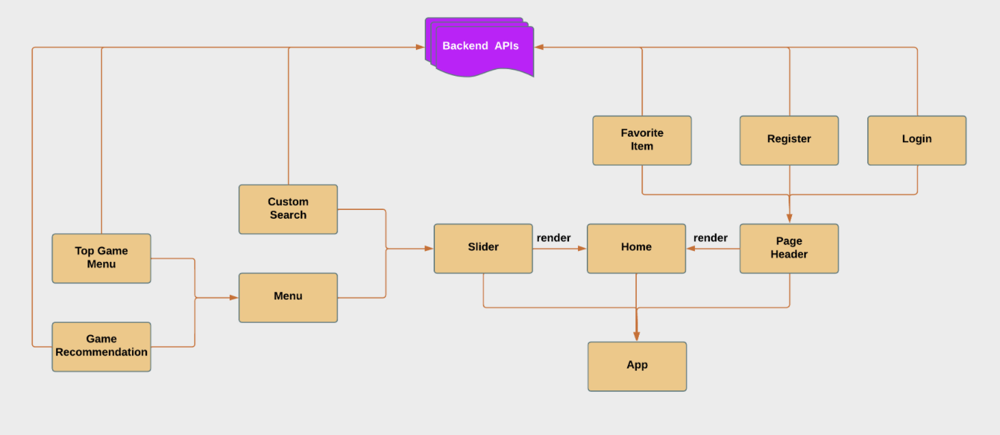
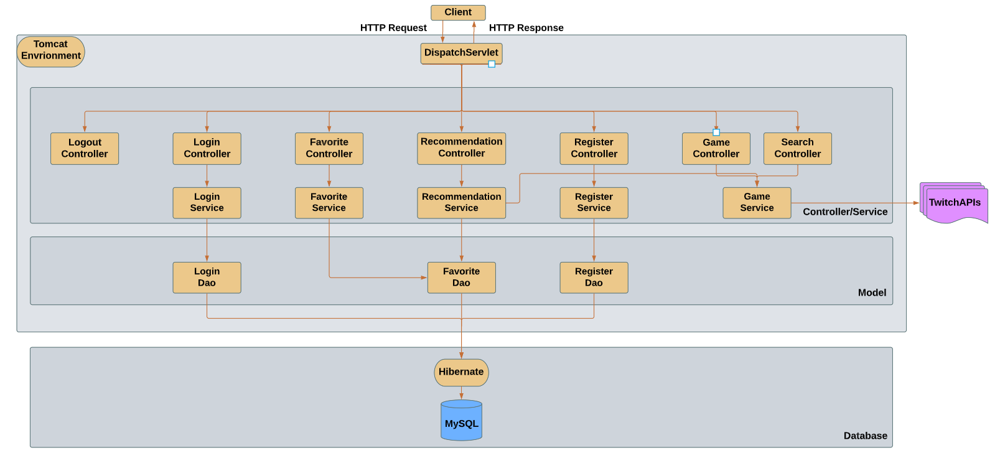
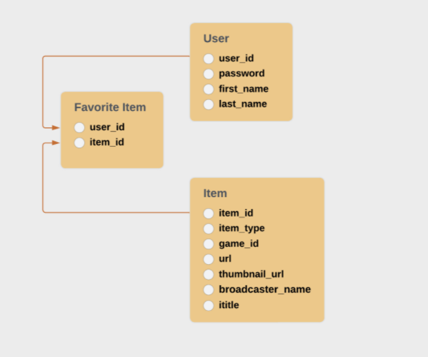

# twitch_game_item_recommendation_project

### *Introduction*

The main goal for this project is to develop efficient and user-friendly game recommendation solution as a web application to users based on the user favorite item history.
User can search games, save favorited game items in a container or delete the favorited game items. The game information requesting from my backend server is based on Twitch APIs. 

`Website link`: http://3.16.112.94/

---

### *Developer Environment*

I use the `JSX` (an extension to Javascript) which is more developer-friendly way to develop code in a combination manner (`Javascript, HTML, CSS`) for the front end development (`React` framrwork based). `Node.js` is used to provide a runtime environment for the Javascript code. The React front end software components will be discuss on the later section. Regarding the backend, I use the `Spring MVC` framework to develop service code (`Java`) and use `Hibernate` framework to query the data from database due to its developer-friendly ORM mechanism. Since the origin sources for front end (localhost:3000) and back end (localhost:8080) are different, I use a proxy server to avoid the errors coming from browers's same-origin policy (only resources from the same domain, host and port can interact with each other).  

In `package.json` file, I include `"proxy": "http://localhost:8080"`. In such way, any broswer request `"http://localhost:3000/<request api>"` will be sent
to proxy server and convert it to `"http://localhost:8080/<request api>"` which is redirected to the backend server. After the front end code is deployed to a remote server, we don't need the proxy since it does not being restricted by the same-origin policy from browser.

---

### *Frontend Software Architecture*



Figure 1. Frontend software architecture design process flow (click the diagram to view in a larger view)

The above diagram shows the relationship between different Javascript components (refer as JS component for short). The main component is `App` which consists of 3 modules (`Slider`, `Page Header` and `Home`). 

---

### *Frontend Software Components*

#### 1. Page Header

The `Page Header` consists of 3 JS components ('Login', 'Register' and 'Favorite Item'). The `Login` and `Register` are used to collect user information and validate them on backend server through the API calls. Once the user is registered and logged in, his/her favorite items (if any) will be pulled from the database, The `Favorite Item` component will be clicked by user to show the favorite items in a drawer manner. The displayed information will be re-rendered on the `Home` component.

#### 2. Slider

The `Slider` component consists of 2 JS component `Custom Search` and `Menu`. The `Custom Search` is a button for the user to display a enter-information window to search games. The searched result will be re-rendered and show on the `Home` component. The second component `Menu` consists of 2 smaller components: `Game Recommendation` and `Top Game`. The `Game Recommendation` is a button for the user to click so that the backend server will recommend some game items based on his/her
favorite item history and display them on `Home` component in 3 tabs: video, clip, stream. The recommendation design will be discussed in backend software components. The `Top Game` is a menu list to display the most popular games to the user, when he/she clicks any game item inside the menu, the information will be displayed to the
`Home` component in 3 tabs: video, clip and stream as well. 

#### 3. Home

The `Home` component is the main spot to display/render any information pulled from backend server through user interaction with other GUI components.

---

### *Backend Software Architecture*



Figure 2. Backend software architecture design process flow (click the diagram to view in a larger view)

---

### *Backend Software Components*

#### 1. Register Controller

    The register controller aims at providing the user registration service. The user information will be saved to database via the Dao.
    
#### 2. Login/Logout Controller
  
    The login controller aims at verifying the user login information. The user login information will be passed to the login Dao, the login Dao will retrieve the  encrypted password by `user_id` and compared to the encrypted password from the user information. 
    
    The logout controller aims at disabling the login status of a user. It will invalidate the session and make the value as `null` for the key `JSESSIONID` in cookie.
    
#### 3. Game Controller
    
    The game controller aims at providing the game information (searched by game name) in JSON format and return the result to front end.
    
#### 4. Search Controller
    
    The search controller aims at providing the game information (searched by `game_id`) in terms of different item type (video, stream, clip) in JSON format and return the result (`Map<String, List<Item>>`) to front end.
    
#### 5. Favorite Controller
  
  The favorite controller processes the user request (CRUD on the favorite item), the update will be reflected to database

  
#### 6. Recommendation Controller

  The recommendation controller leverages the favorite items from user to recommend the similar game items to the user. It will first get all the favorite items from database and get the top 3 `game_id`. Then it will leverage the game service to search items (video, stream, clip) based on the `game_id` and return the result to front end. 
  
   ```
   Map<String, List<Item>> result
   get the favorite items from database -> Map<String, List<String>> // game item type, list of game_ids
   for each game item type (video, stream, clip)
        recommend the top 3 item (item type, game_id) by game service (search by item type)
        save to the result
 
   ```
---

### *Database*

The selected database is relational database (AWS-SQL), since it can clearly relates the user information and game items. The relation mapping is many-to-many, since one user can favor multiple items and one item can be favored by multiple users. The attached shema shows the relationship below:



Figure 3. RDBMS schema (user, item, favorite item) 

In order to make the database query more conveniently, I use the Hibernate to achieve the object relation mapping (ORM) idea (object oriented way to interact with database) so that I can only write Java code to interact with the database rather than using the SQL language directly. 
 
 ---
 
### *Deployment*

The front end code built by `npm` is saved under the `webapp` folder on backend code. The backend code is then built by `maven` to generate a `.jar` package. I register a virtual machine (Ubuntu based) through AWS EC2 service and use SSH key to access it. In order to provide an isolated running environment for this project, I choose the docker as the deploy tool to build the image file, which will be run as an isolated docker container. The provided web server for backend code is `Apache Tomcat` inside the container. 
