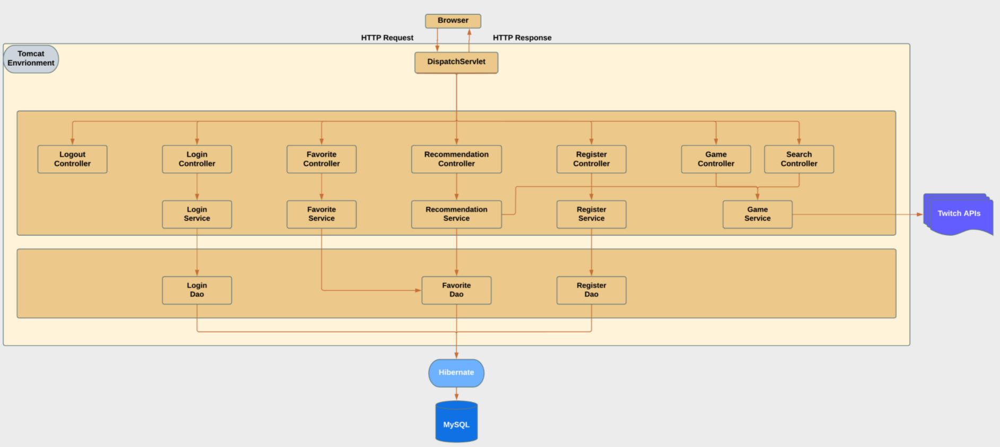

# twitch_project

### Introduction

### Developer Environment


### Software Architecture



Figure 1. Backend software architecture design process flow 

### Software Components

#### 1. Register Controller

    The register controller aims at providing the user registration service. The user information will be saved to database via the Dao.
    
#### 2. Login/Logout Controller
  
    The login controller aims at verifying the user login information. The user login information will be passed to the login Dao, the login Dao will retrieve the  encrypted password by `user_id` and compared to the encrypted password from the user information. 
    
    The logout controller aims at disabling the login status of a user. It will invalidate the session and make the value as `null` for the key `JSESSIONID` in cookie.
    
#### 3. Game Controller
    
    The game controller aims at providing the game information (searched by game name) in JSON format and return the result to front end.
    
#### 4. Search Controller
    
    The search controller aims at providing the game information (searched by `game_id`) in terms of different item type (video, stream, clip) in JSON format and return the result (`Map<String, List<Item>>`) to front end.
    
#### 5. Favorite Controller
  
  The favorite controller processes the user request (CRUD on the favorite item), the update will be reflected to database

  
#### 6. Recommendation Controller

  The recommendation controller leverages the favorite items from user to recommend the similar game items to the user. It will first get all the favorite items from database and get the top 3 `game_id`. Then it will leverage the game service to search items (video, stream, clip) based on the `game_id` and return the result to front end. 
  
   ```
   Map<String, List<Item>> result
   get the favorite items from database -> Map<String, List<String>> // game item type, list of game_ids
   for each game item type (video, stream, clip)
        recommend the top 3 item (item type, game_id) by game service (search by item type)
        save to the result
 
   ```
### Database


object oriented way to interact with database

RDBMS

Schema

user

### Deployment
